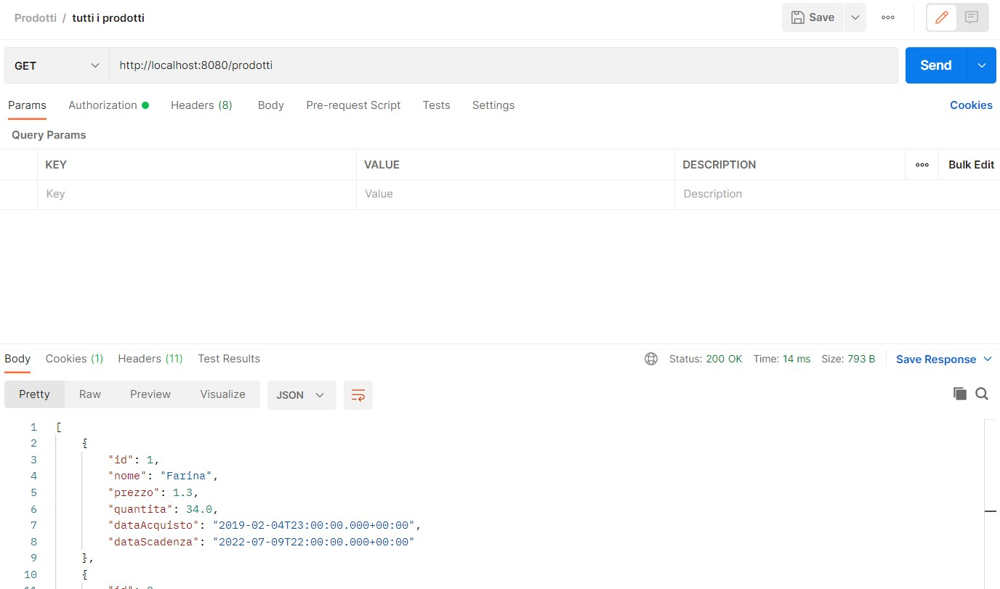
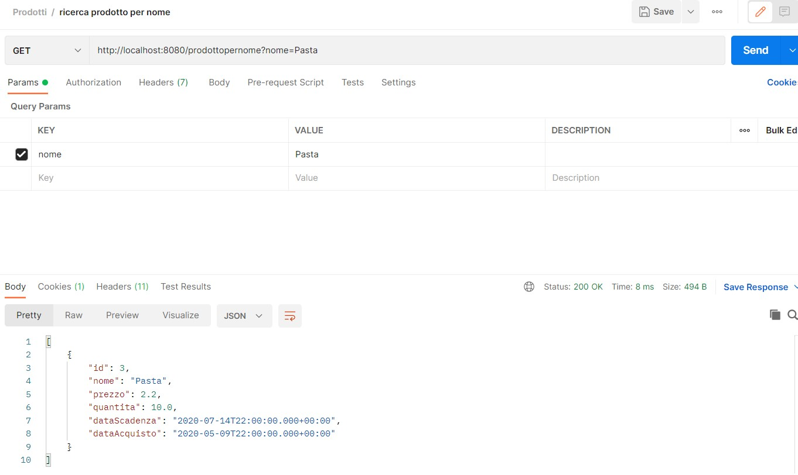
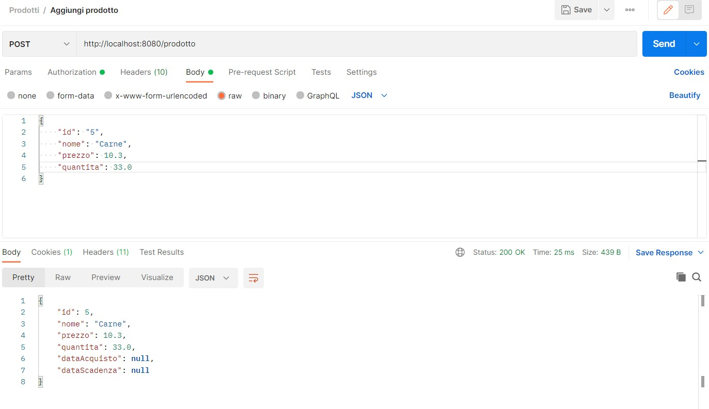
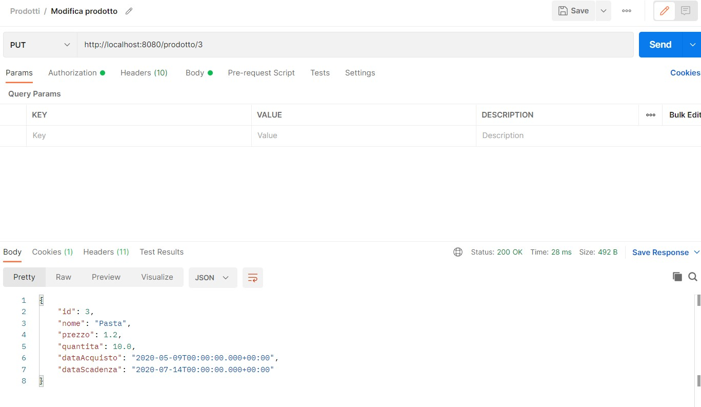
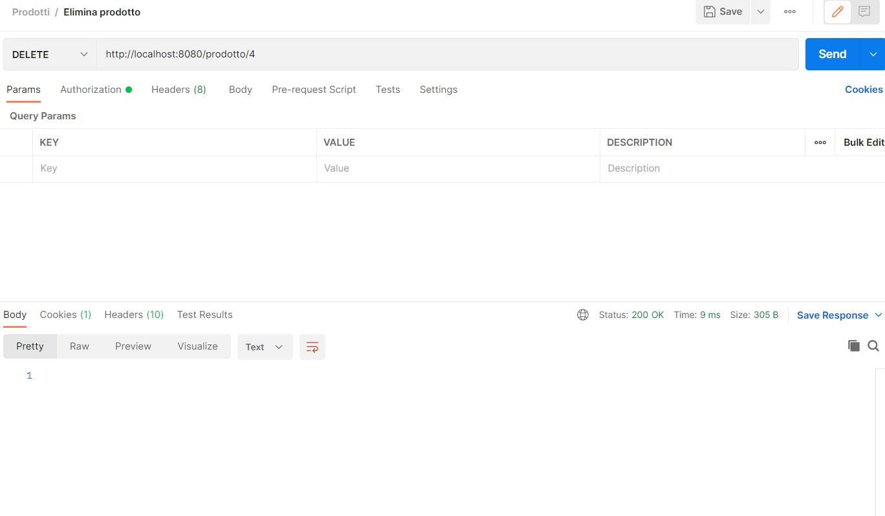
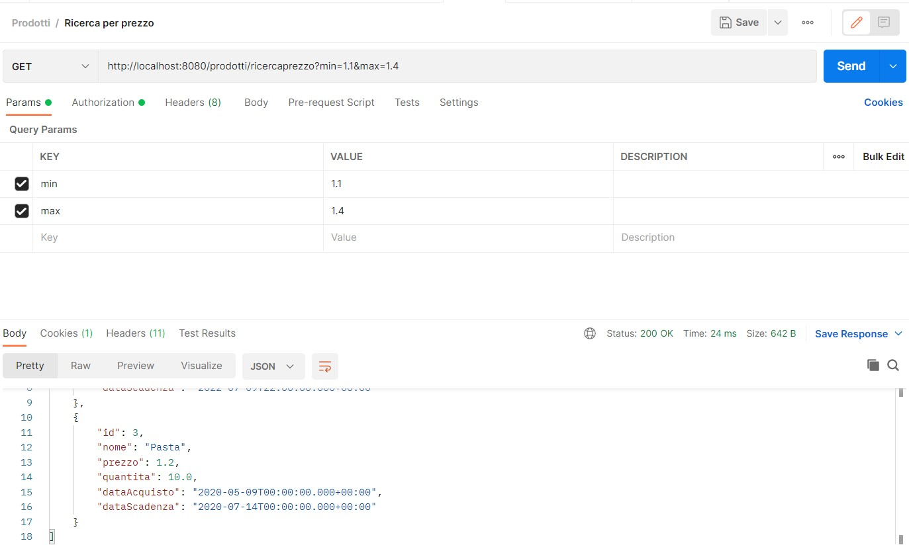
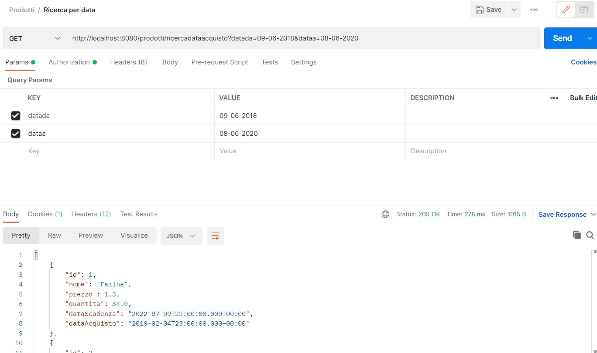
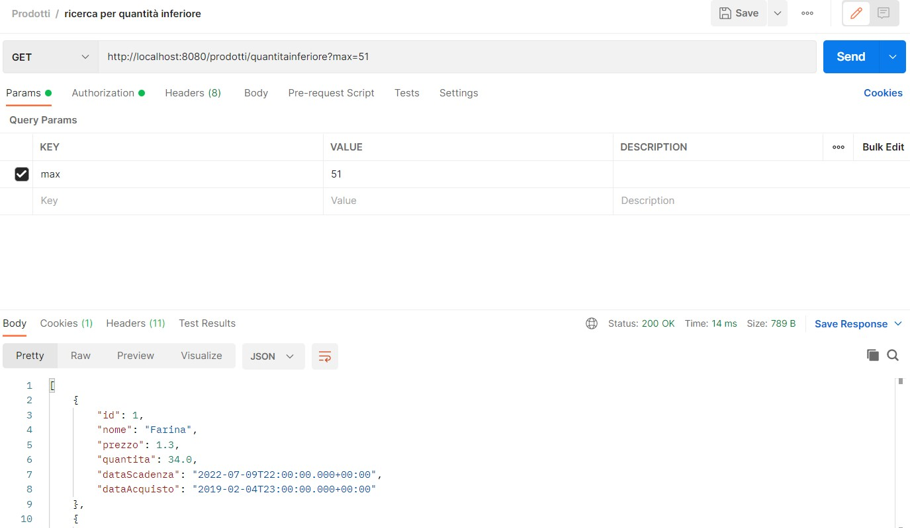
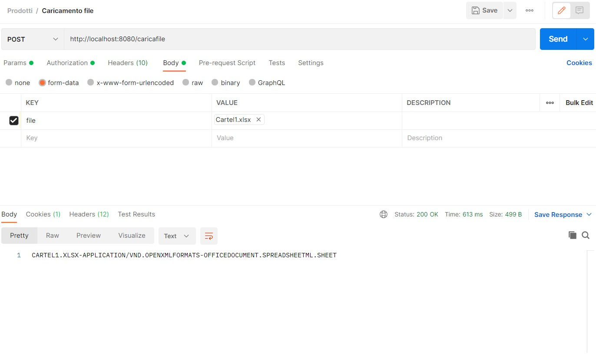

# EsercizioApplicazioneProdotto
Applicazione Spring web per gestire le richieste database tramite Postman 

##TUTTI I PRODOTTI

##RICERCA PRODOTTI PER ID

##RICERCA PRODOTTI PER NOME

##AGGIUNGI PRODOTTO

##MODIFICA PRODOTTO

##ELIMINA PRODOTTO

##RICERCA PER PREZZO

##RICERCA PER DATA

##RICERCA PER QUANTITA INFERIORE

##CARICAMENTO FILE

